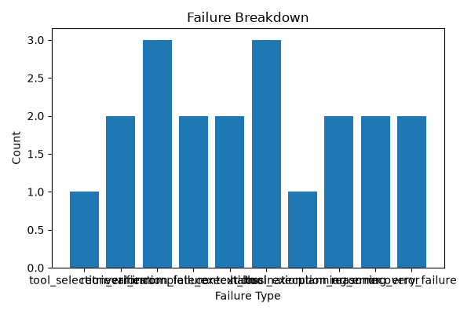

# Agent Trajectory Analyzer V2
[](https://github.com/Hanw-ai/Agent-Trajectory-Analyzer/actions/workflows/test.yml)

A trajectory-level evaluation framework for diagnosing planning,
retrieval, tool-use, grounding, verification, and recovery failures
in LLM agents.

## V2 Highlights
- Real LLM-as-Judge evaluation with structured outputs
- Deterministic offline judge for reproducible CI
- Pass/fail and failure-type agreement analysis
- Judge disagreement case inspection
- Confusion matrix and CSV artifact generation
- Benchmark tasks across tool use, retrieval, coding, and planning
- Automated Markdown reporting and failure visualization

## Evaluation Results

The current V2 benchmark evaluates 10 agent trajectories across
tool use, retrieval, coding, planning, verification, and reasoning.

### Current Benchmark Summary

| Metric | Result |
|---|---:|
| Total Tasks | 10 |
| Success Rate | 40.00% |
| Average Trajectory Length | 2.50 |
| Tool Error Rate | 10.00% |
| Trajectory Score | 35.00 |
| Dominant Failure Mode | `tool_selection_error` |

These metrics are generated directly from
`data/trajectories_v2.json` by the evaluation pipeline.

### Failure Breakdown



The failure distribution above is generated automatically from the
benchmark and helps identify recurring execution failure modes.

### Judge Agreement

| Metric | Result |
|---|---:|
| Pass/Fail Agreement | 100.00% |
| Failure-Type Agreement | 100.00% |
| Mean Score Difference | 0.00 |
| Disagreement Count | 0 |

The current offline benchmark produces full agreement between the
deterministic evaluator and the offline fallback judge. More ambiguous
cases will be added in future benchmark expansions.

### Generated Artifacts

| Artifact | Purpose |
|---|---|
| `reports/v2_report.md` | Human-readable evaluation summary |
| `reports/judge_results.csv` | Per-trajectory evaluator outputs |
| `reports/disagreements.csv` | Judge disagreement cases |
| `reports/confusion_matrix.csv` | Pass/fail agreement matrix |
| `reports/failure_breakdown.png` | Failure-mode distribution chart |

## Why This Project Matters

Agent failures are often caused by intermediate execution decisions,
not only by the quality of the final answer.

A final answer may appear plausible even when the agent:

- selects the wrong tool;
- retrieves irrelevant evidence;
- loses important context;
- produces unsupported claims;
- fails to recover from a tool error;
- terminates without verifying completion.

This framework evaluates the complete execution trajectory and identifies the likely root cause of failure.

Evaluation Architecture
Agent Trajectory
       |
       +--------------------+
       |                    |
       v                    v
Rule-Based Judge      LLM-as-Judge
       |                    |
       +---------+----------+
                 |
                 v
       Agreement Analysis
                 |
       +---------+----------+
       |                    |
       v                    v
Failure Diagnosis    Disagreement Review
                 |
                 v
       Markdown + CSV Reports


## Why This Project Matters

Modern LLM agents often fail not because the final answer is poorly written, but because the intermediate trajectory is flawed.

Common failure modes include:

- Retrieval error
- Tool selection error
- Reasoning error
- Hallucination
- Overlong trajectory
- Failure to recover from bad tool outputs

This framework analyzes those failures from agent traces.

## Features

- Analyze agent trajectories step by step
- Compute success rate
- Measure average trajectory length
- Track tool usage distribution
- Detect failure root causes
- Generate an evaluation report

## LLM-as-Judge

The framework supports two complementary evaluation modes:

| Evaluator | Description |
|---|---|
| Rule-Based Judge | Deterministic evaluator for reproducible local and CI runs |
| LLM-as-Judge | OpenAI model evaluator using structured Pydantic outputs |
| Offline Fallback | Deterministic approximation used when no API key is available |

## Example Trajectory

```json
{
  "task_id": "task_001",
  "task": "Find the top 3 competitors of OpenAI in AI coding assistants.",
  "success": true,
  "steps": [
    {
      "step": 1,
      "tool": "search",
      "input": "top AI coding assistant competitors",
      "output": "Found Cursor, Anthropic Claude Code, GitHub Copilot"
    },
    {
      "step": 2,
      "tool": "browser",
      "input": "Cursor AI website",
      "output": "Extracted product details"
    }
  ],
  "failure_reason": null
}

## How to Run

Clone repository

```bash
git clone https://github.com/Hanw-ai/Agent-Trajectory-Analyzer.git
```

Install dependencies

```bash
pip install -r requirements.txt
```

Run analyzer

```bash
python demo.py
```
## Example Output

```text
Agent Trajectory Analysis Results

{
  'total_tasks': 5,
  'success_rate': 0.4,
  'avg_trajectory_length': 2.4,
  'tool_usage': {
      'search': 3,
      'browser': 4,
      'summarizer': 5
  },
  'failure_breakdown': {
      'retrieval_error': 1,
      'tool_selection_error': 1,
      'hallucination': 1
  },
  'tool_error_rate': 0.2,

 
  'judge_results': [...]
}

Report generated:
reports/evaluation_report.md
```

## Current Version

- V1: Trajectory metrics and failure analysis
- V2: LLM-as-Judge and judge agreement


## Failure Analysis


## Root Cause Analysis

The analyzer identifies the dominant failure mode across failed agent trajectories.

This helps diagnose whether an agent primarily fails because of:

- Poor retrieval
- Incorrect tool routing
- Unsupported generation
- Reasoning failure
- Recovery failure

This is useful for debugging agentic systems such as coding agents, research agents, browser agents, and tool-using assistants.

## V2: LLM-as-Judge + Judge Agreement

This project includes two judge types:

| Judge | Description |
|---|---|
| Rule-Based Judge | Uses explicit failure labels and success signals |
| LLM-as-Judge | Evaluates trajectory quality, tool use, and grounding behavior |

The framework computes judge agreement to measure consistency between deterministic ground-truth-derived evaluation and model-based trajectory evaluation.

This mirrors common evaluation workflows for agentic systems, where model outputs are assessed using both programmatic checks and LLM-based evaluators.

{
  ## Repository Structure

```text
Agent-Trajectory-Analyzer/
├── data/
│   ├── sample_trajectories.json
│   └── trajectories_v2.json
├── reports/
│   ├── evaluation_report.md
│   ├── judge_results.csv
│   ├── disagreements.csv
│   ├── confusion_matrix.csv
│   └── failure_breakdown.png
├── src/
│   ├── analyzer.py
│   ├── judges.py
│   ├── llm_judge.py
│   ├── judge_agreement.py
│   ├── metrics.py
│   ├── report.py
│   └── visualization.py
├── tests/
├── demo.py
├── requirements.txt
└── README.md
